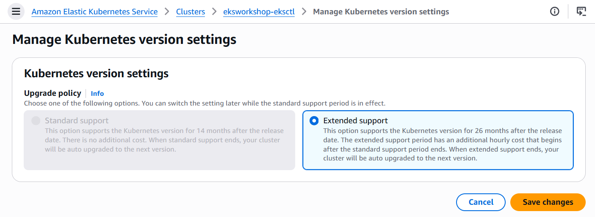
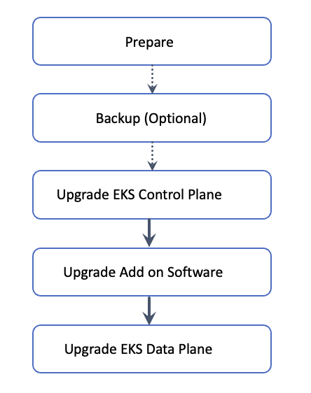
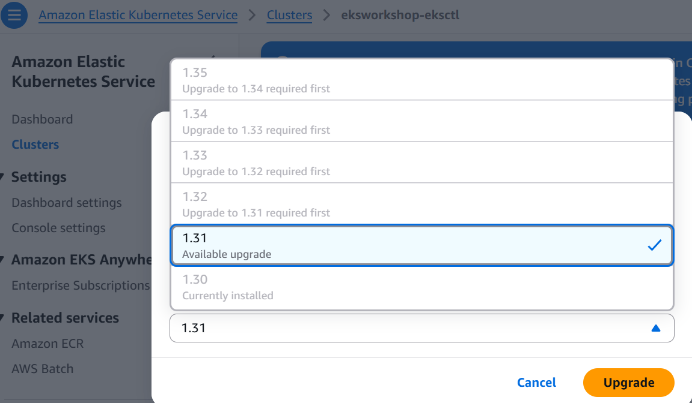
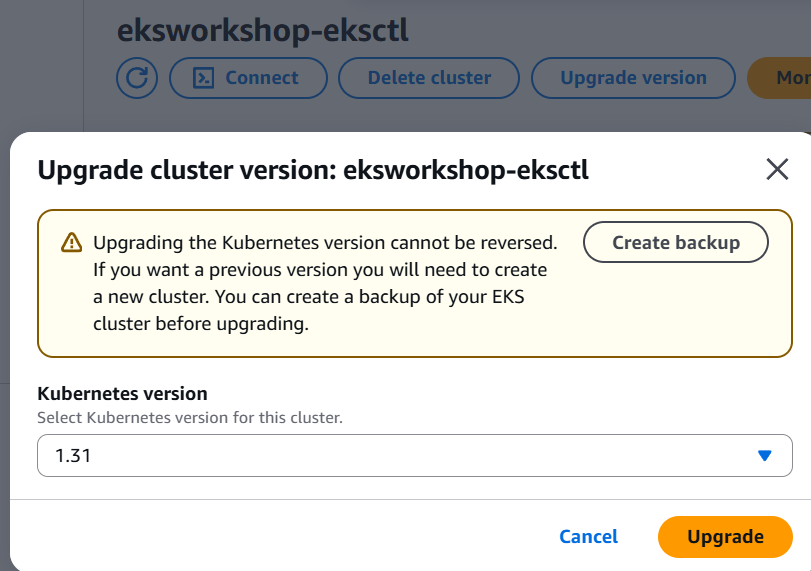
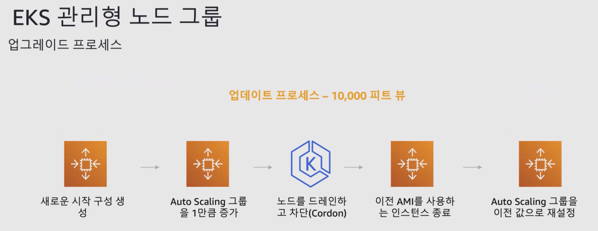
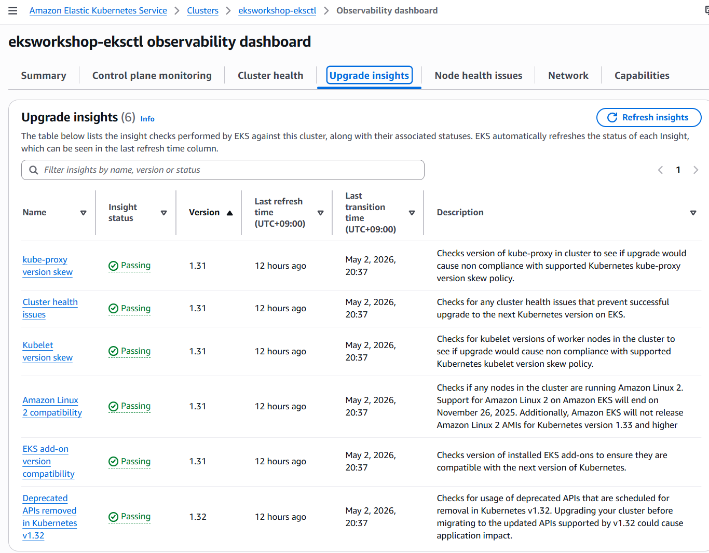

<script>
  if (!window.location.pathname.includes('2026-aws-eks-workshop-study')) {
    const destination = "https://syloa.github.io/2026-aws-eks-workshop-study/kubernetes/eks/aews/aews-week07-01/";
    window.location.replace(destination);
  }
</script>

<noscript>
  <meta http-equiv="refresh" content="0; url=https://syloa.github.io/2026-aws-eks-workshop-study/kubernetes/eks/aews/aews-week07-01/">
</noscript>

> *CloudNet 팀의 [2026년 AWS EKS Workshop Study 4기](https://gasidaseo.notion.site/26-AWS-EKS-Hands-on-Study-4-31a50aec5edf804b8294d8d512c43370) 7주차 학습 내용을 담고 있습니다.*
> 
> *[Amazon EKS Upgrades: Strategies and Best Practices](https://catalog.us-east-1.prod.workshops.aws/workshops/693bdee4-bc31-41d5-841f-54e3e54f8f4a/en-US) 워크샵을 정리하였습니다.*

---

## K8s 및 EKS 버전 

K8s 버전은 x.y.z와 같이 표현됩니다.
x는 메이저 버전, y는 마이너 버전, z는 패치 버전을 의미합니다.

### EKS 버전 릴리즈 주기 

Vanaila K8s는 평균 4개월마다 신규 마이너 버전이 릴리즈되며, EKS는 Vanila K8s의 마이너 버전 릴리즈/지원 중단 주기를 따릅니다. 

릴리즈 속도가 빠른 편이라, 운영에 있어서는 부담이 되기도 합니다. 실제로 담당 고객사 중 한 곳에서 업그레이드에 지쳐 결국 EKS 기반 애플리케이션을 걷어내버리신 사례가 있습니다...

- EKS 버전은 14개월 동안 표준 지원(Standard Support)을 받습니다.
- 이후에는 추가 비용(0.5 USD for per hour)을 지불하여 12개월 동안 연장 지원(Extended Support) 지원을 받을 수 있습니다.
    - 표준 지원(Standard Support): 클러스터 시간당 0.1 USD
    - 연장 지원(Extended Support): 클러스터 시간당 0.6 USD
- Extended Support마저도 지원이 종료되고 나면 다음 버전으로 자동 업그레이드 됩니다.
- 표준 지원 종료 시 연장 지원으로 전환할지 여부를 업그레이드 정책으로 설정할 수 있습니다.
    - 


## 업그레이드 권장 순서

Control Plane → Node Group → Add-ons → 클라이언트/SDK 업그레이드 순서로 진행하는 것을 권고합니다.

### Cluster In-place Upgrade Workflow



1. K8s 및 EKS 릴리스 노트 검토
2. 클러스터 백업(선택 사항)
3. 워크로드에서 더 이상 사용되지 않거나 제거된 API 사용 식별 및 수정
4. 기존 노드와 컨트롤 플레인 간 버전 호환성 확인
5. 클러스터 컨트롤 플레인 업그레이드
6. Add-on 호환성 검토, 필요 시 Add-on과 Custom Controller 업그레이드
7. kubectl 업데이트
8. 클러스터 데이터 플레인을 업그레이드된 클러스터와 동일한 마이너 버전으로 업그레이드


## Control Plane 업그레이드

### Control Plane 업그레이드 전 확인사항

- 클러스터 생성 시 지정된 서브넷에 5개의 여유 Private IP 주소가 있어야 한다.
    - 
```bash
aws ec2 describe-subnets --subnet-ids \
  $(aws eks describe-cluster --name ${CLUSTER_NAME} \
  --query 'cluster.resourcesVpcConfig.subnetIds' \
  --output text) \
  --query 'Subnets[*].[SubnetId,AvailabilityZone,AvailableIpAddressCount]' \
  --output table
```
- EKS IAM 역할이 올바르게 구성되어있는지 확인한다.
    - 
```bash
ROLE_ARN=$(aws eks describe-cluster --name ${CLUSTER_NAME} \
  --query 'cluster.roleArn' --output text)
aws iam get-role --role-name ${ROLE_ARN##*/} \
  --query 'Role.AssumeRolePolicyDocument'
```
- 현재 버전보다 1단계 상위 버전으로만 업그레이드가 가능하다. (In-place 업그레이드 시)
    - 
- Pod Security Policy, Security Groups, Cluster 서브넷이 그대로 유지되는지 확인한다.

### EKS Controle Plane 업그레이드 방법

컨트롤 플레인은 AWS가 관리하므로 사용자가 아래의 방법으로 업그레이드를 트리거하면 자동으로 업그레이드 작업이 진행됩니다. 

- AWS Console
    - 콘솔에서 업그레이드 대상 클러스터를 열어 업그레이드 진행
    - 
- CLI
    - `aws eks update-cluster-version --region <aws-region> -name <clustername> --kubernetes-version <version>`
- eksctl
    - `eksctl upgrade cluster --name=<clustername> --version=<version>`
- CloudFormation
    - verion 파라미터를 업그레이드 대상 버전으로 변경
```yaml
{
    "EKSCluster": {
       "Type": "AWS::EKS::Cluster",
       "Properties": {
          "Name": "Prod",
          "Version": "1.30",
```

- Terraform
    - version 파라미터를 업그레이드 대상 버전으로 변경
```yaml
variable "cluster_version" {
  description = "EKS cluster version."
  type        = string
  default     = "1.30"
}
```

AWS 내부적으로 Blue/Green 배포 방식으로 업그레이드가 진행되며, 최대 10분이 소요됩니다.
컨트롤 플레인 업그레이드에 문제가 발생하는 경우 업그레이드는 롤백됩니다.
HA 모드로 배포되어있으므로 `kubectl` 명령이나 애플리케이션에 대한 중단은 없거나 매우 짧습니다.

### EKS Node Group Upgrade

#### Best Practice

- 컨트롤 플레인과 노드 그룹의 버전을 동일하게 유지합니다.
- Cluster Auto Scaler Add-on이 설치된 경우 이를 0으로 축소합니다.
- PDB(PodDisruptionBudgets)을 평가합니다.
- 자체 관리형 노드 그룹을 EKS 관리형 노드 그룹으로 마이그레이션합니다.

#### EKS 관리형 노드 그룹 업그레이드



- 노드 그룹 업데이트 구성
    - 숫자: 병렬로 업데이트할 수 있는 노드 수를 선택하고 지정합니다.
    - 백분율: 병렬로 업데이트할 수 있는 노드의 백분율을 선택하고 지정합니다.

#### Karpenter 노드 업그레이드

Karpenter는 Drift 기능을 사용하여 노드의 변경을 감지합니다.

#### Fargate 노드 그룹 업그레이드

Fargate 노드는 직접 업그레이드가 불가능하며, 컨트롤 플레인 업그레이드 후 워크로드를 재배포하면 새 버전의 Fargate 노드가 자동으로 할당됩니다.

| | EC2 (Managed Node Group) | Fargate |
| --- | --- | --- |
| 업그레이드 방식 | 노드 자체를 Rolling 교체 | 워크로드 재배포 |
| 제어권 | 사용자가 직접 트리거 | 재배포 시 AWS가 자동 할당 |


```bash
# Fargate 노드에서 실행 중인 Pod 확인
kubectl get pods -o wide --all-namespaces | grep fargate-

# 해당 Deployment 재배포
kubectl rollout restart deployment <deployment-name> -n <namespace>
```

#### EKS Auto Mode 노드 업그레이드

클러스터가 EKS Auto Mode를 사용하여 생성된 경우 클러스터 데이터 플레인을 업그레이드할 필요가 없습니다. 

컨트롤 플레인을 업그레이드하면 EKS Auto Mode가 모든 PDB(PodDisruptionBudgets)를 준수하면서 관리 노드를 점진적으로 업데이트합니다.

### EKS Add-on 업그레이드

- 관리형 Add-on: AWS 콘솔/config를 사용한 `eksctl`
- 자체 관리형: config 없이 `eksctl` 사용/기타 방법

### Upgrade Insights

클러스터의 감사 로그를 스캔하여 더 이상 사용되지 않는 리소스를 찾아내고 해당 정보를 EKS 콘솔에 표시합니다.




<!-- ## In-Place Upgrade vs Blue-Green Upgrade -->