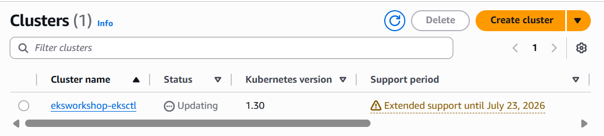
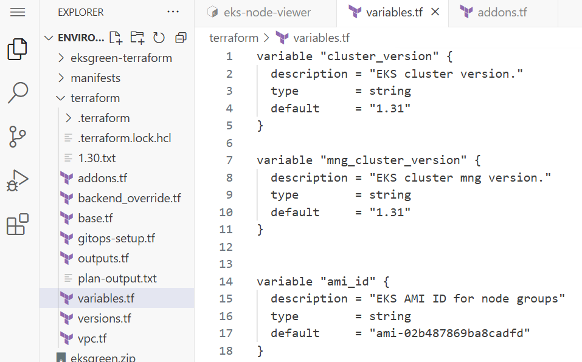

<script>
  if (!window.location.pathname.includes('2026-aws-eks-workshop-study')) {
    const destination = "https://syloa.github.io/2026-aws-eks-workshop-study/kubernetes/eks/aews/aews-week07-02/";
    window.location.replace(destination);
  }
</script>

<noscript>
  <meta http-equiv="refresh" content="0; url=https://syloa.github.io/2026-aws-eks-workshop-study/kubernetes/eks/aews/aews-week07-02/">
</noscript>

> *CloudNet 팀의 [2026년 AWS EKS Workshop Study 4기](https://gasidaseo.notion.site/26-AWS-EKS-Hands-on-Study-4-31a50aec5edf804b8294d8d512c43370) 7주차 학습 내용을 담고 있습니다.*
> 
> *[Amazon EKS Upgrades: Strategies and Best Practices](https://catalog.us-east-1.prod.workshops.aws/workshops/693bdee4-bc31-41d5-841f-54e3e54f8f4a/en-US) 워크샵을 정리하였습니다.*

---


## Control Plane Upgrade

콘솔/CLI/eksctl/CloudFormation/Terraform 의 방법 중, 워크샵 가이드에 따라 Terraform의 변수를 수정하여 Control Plane을 업그레이드합니다.
"1.30" -> "1.31"

```yaml
variable "cluster_version" {
  description = "EKS cluster version."
  type        = string
  default     = "1.31"
}
```

```bash
terraform plan && terraform apply -auto-approve
```



## Add-ons / Custom controller Update

CoreDNS, kube-proxy, VPC CNI, EBS CSI Driver의 버전을 업그레이드합니다.

```bash
# 가능한 업그레이드 버전 정보 확인
$ eksctl get addon --cluster $CLUSTER_NAME
NAME                    VERSION                 STATUS  ISSUES  IAMROLE       UPDATE AVAILABLE                                                               CONFIGURATION VALUES
aws-ebs-csi-driver      v1.59.0-eksbuild.1      ACTIVE  0       arn:aws:iam::558235332608:role/eksworkshop-eksctl-ebs-csi-driver-2026050211254631980000001d
coredns                 v1.11.4-eksbuild.32     ACTIVE  0
kube-proxy              v1.30.14-eksbuild.28    ACTIVE  0                     v1.31.14-eksbuild.12,v1.31.14-eksbuild.9,v1.31.14-eksbuild.6,v1.31.14-eksbuild.5,v1.31.14-eksbuild.2,v1.31.13-eksbuild.2,v1.31.10-eksbuild.12,v1.31.10-eksbuild.8,v1.31.10-eksbuild.6,v1.31.10-eksbuild.2,v1.31.9-eksbuild.2,v1.31.7-eksbuild.7,v1.31.3-eksbuild.2,v1.31.2-eksbuild.3,v1.31.2-eksbuild.2,v1.31.1-eksbuild.2,v1.31.0-eksbuild.5,v1.31.0-eksbuild.2
vpc-cni                 v1.21.1-eksbuild.8      ACTIVE  0

# coredns - EKS 1.31 버전과 호환되는 애드온 버전 확인
$ aws eks describe-addon-versions --addon-name coredns --kubernetes-version 1.31 --output table \
    --query "addons[].addonVersions[:10].{Version:addonVersion,DefaultVersion:compatibilities[0].defaultVersion}"
    
# kube-proxy - EKS 1.31 버전과 호환되는 애드온 버전 확인
$ aws eks describe-addon-versions --addon-name kube-proxy --kubernetes-version 1.31 --output table \
    --query "addons[].addonVersions[:10].{Version:addonVersion,DefaultVersion:compatibilities[0].defaultVersion}"
    
# addons.tf 수정
  eks_addons = {
    coredns = {
      addon_version = "v1.11.4-eksbuild.33" # EKS 1.31 권장버전
    }
    kube-proxy = {
      addon_version = "v1.31.14-eksbuild.9" # EKS 1.31 권장버전
    }
    vpc-cni = {
      most_recent = true
    }
    aws-ebs-csi-driver = {
      addon_version = "v1.59.0-eksbuild.1" # EKS 1.31 권장버전
      service_account_role_arn = module.ebs_csi_driver_irsa.iam_role_arn
    }
  }

$ terraform plan
$ terraform apply -auto-approve

# 업그레이드 된 Add-on 확인
# 내부적으로 롤링 업데이트가 진행됩니다.
$ kubectl get pod -n kube-system -l 'k8s-app in (kube-dns, kube-proxy)'

kubectl get pods --all-namespaces -o jsonpath="{.items[*].spec.containers[*].image}" | tr -s '[[:space:]]' '\n' | sort | uniq -c

      8 602401143452.dkr.ecr.us-west-2.amazonaws.com/eks/aws-ebs-csi-driver:v1.59.0
      2 602401143452.dkr.ecr.us-west-2.amazonaws.com/eks/coredns:v1.11.4-eksbuild.33
      6 602401143452.dkr.ecr.us-west-2.amazonaws.com/eks/kube-proxy:v1.31.14-eksbuild.9

```

## Node Group Upgrade

### In-Place Managed Node group Upgrade

Terraform의 `variable.tf`에서 `mng_cluster_version`을 `1.30` → `1.31`로 변경합니다.

사용자 지정 AMI를 직접 지정한 custom 노드그룹의 경우, K8s 1.31에 해당하는 AMI ID를 별도로 조회하여 반영합니다.

```bash
# initial 노드그룹: variable.tf에서 mng_cluster_version을 "1.31"로 변경

# custom 노드그룹: 1.31 AMI ID 조회
aws ssm get-parameter --name /aws/service/eks/optimized-ami/1.31/amazon-linux-2023/x86_64/standard/recommended/image_id \
  --region $AWS_REGION --query "Parameter.Value" --output text
# ami-02b487869ba8cadfd
```



```bash
# 모니터링
watch -d "aws autoscaling describe-auto-scaling-groups --query 'AutoScalingGroups[*].AutoScalingGroupName' --output json | jq; echo ; kubectl get node -L eks.amazonaws.com/nodegroup; echo; date ; echo ; kubectl get node -L eks.amazonaws.com/nodegroup-image | grep ami"

# 약 20분 소요
terraform apply -auto-approve
```

업그레이드 진행 중 노드 상태 변화를 확인할 수 있습니다. 기존 노드는 `SchedulingDisabled` 상태로 전환된 후 새 노드로 교체됩니다.

```bash
# 업그레이드 완료 후 노드 버전 확인
kubectl get node -L eks.amazonaws.com/nodegroup
```

다음 실습을 위해 custom 노드그룹은 `base.tf`에서 제거 후 재적용합니다.

```bash
terraform apply -auto-approve
```

---

### Blue-Green Managed Node Group Upgrade

상태 저장 워크로드(orders-mysql, EBS PVC 사용)가 배포된 blue-mng 노드그룹을 B/G 방식으로 업그레이드합니다.

blue-mng은 특정 AZ, Taint/Label이 지정된 노드그룹입니다.

```bash
# blue-mng 노드 확인
kubectl get nodes -l type=OrdersMNG

# Taint 확인
kubectl get nodes -l type=OrdersMNG -o jsonpath="{range .items[*]}{.metadata.name} {.spec.taints[?(@.effect=='NoSchedule')]}{\"\n\"}{end}"

# 해당 노드에서 실행 중인 파드 확인
kubectl describe node -l type=OrdersMNG
```

`base.tf`에 동일한 AZ, Taint/Label을 가진 green-mng 노드그룹을 추가합니다. (cluster_version은 1.31 사용)

```bash
# 모니터링
watch -d "aws autoscaling describe-auto-scaling-groups --query 'AutoScalingGroups[*].AutoScalingGroupName' --output json | jq; echo ; kubectl get node -L eks.amazonaws.com/nodegroup; echo; date"

# 약 3분 소요
terraform apply -auto-approve

# green-mng 노드 생성 확인 (동일 AZ, 1.31 버전)
kubectl get node -l type=OrdersMNG -L topology.kubernetes.io/zone
# NAME                                       STATUS   ROLES    AGE    VERSION                ZONE
# ip-10-0-0-159.us-west-2.compute.internal   Ready    <none>   109s   v1.31.14-eks-bbe087e   us-west-2a
# ip-10-0-7-77.us-west-2.compute.internal    Ready    <none>   46h    v1.30.14-eks-bbe087e   us-west-2a
```

PDB로 인한 블로킹을 방지하기 위해 orders 파드 replicas를 2로 늘린 후 blue-mng를 `base.tf`에서 제거합니다.

```bash
# replicas 증가
kubectl scale deploy -n orders orders --replicas 2

# blue-mng 제거 후 적용 (약 10분 소요)
terraform apply -auto-approve

# 최종 노드그룹 확인 (green-mng만 남아있어야 함)
aws eks list-nodegroups --cluster-name eksworkshop-eksctl
# {
#     "nodegroups": [
#         "green-mng-20260424075552962200000007",
#         "initial-2026042209254538750000002b"
#     ]
# }
```

---

### Upgrading Karpenter Managed Nodes

Karpenter의 Drift 기능을 활용하여 AMI를 업데이트하면 기존 노드가 새 노드로 자동 교체됩니다.

```bash
# 현재 카펜터 노드 버전 확인
kubectl get nodes -l team=checkout


# 현재 사용 중인 AMI 확인
kubectl get ec2nodeclass default -o yaml | grep 'id: ami-' | uniq

# 1.31 AMI ID 조회
aws ssm get-parameter --name /aws/service/eks/optimized-ami/1.31/amazon-linux-2023/x86_64/standard/recommended/image_id \
    --region ${AWS_REGION} --query "Parameter.Value" --output text
```

`default-ec2nc.yaml`의 `spec.amiSelectorTerms` AMI ID를 1.31 버전으로 교체하고, `default-np.yaml`의 `spec.disruption`에 중단 예산을 추가합니다.

```yaml
# default-np.yaml 중단 예산 추가
budgets:
  - nodes: "1"
    reasons:
    - Drifted
```

```bash
# 변경사항 적용 (ArgoCD를 통해 동기화)
cd ~/environment/eks-gitops-repo
git add apps/karpenter/default-ec2nc.yaml apps/karpenter/default-np.yaml
git commit -m "disruption changes"
git push --set-upstream origin main
argocd app sync karpenter

# 카펜터 컨트롤러 로그에서 Drift 이벤트 확인
kubectl -n karpenter logs deployment/karpenter -c controller --tail=33 -f

# 1.31 버전 노드로 교체 완료 확인
kubectl get nodes -l team=checkout
```

---

### Upgrading Self-managed Nodes

`base.tf`의 `self_managed_node_groups`에서 `ami_id`를 1.31 버전으로 교체 후 적용합니다.

```bash
# 1.31 AMI ID 조회
aws ssm get-parameter --name /aws/service/eks/optimized-ami/1.31/amazon-linux-2023/x86_64/standard/recommended/image_id \
  --region $AWS_REGION --query "Parameter.Value" --output text

# 모니터링
while true; do kubectl get nodes -l node.kubernetes.io/lifecycle=self-managed; echo ; \
  aws ec2 describe-instances --query "Reservations[*].Instances[*].[Tags[?Key=='Name'].Value | [0], ImageId]" \
  --filters "Name=tag:Name,Values=default-selfmng" --output table; echo ; date; sleep 1; echo; done

# 적용
cd ~/environment/terraform/
terraform apply -auto-approve

# 1.31 버전 노드 확인
kubectl get nodes -l node.kubernetes.io/lifecycle=self-managed
```

신규 버전 EC2가 Ready된 후 기존 노드를 순차적으로 종료합니다. ASG가 자동으로 처리합니다.

---

### Upgrading Fargate Nodes

Fargate 노드는 Deployment를 재시작하는 것만으로 새 버전의 노드에 스케줄됩니다.

```bash
# 현재 Fargate 노드 버전 확인
kubectl get node $(kubectl get pods -n assets -o jsonpath='{.items[0].spec.nodeName}') -o wide

# Deployment 재시작
kubectl rollout restart deployment assets -n assets

# 새 파드가 Ready 될 때까지 대기
kubectl wait --for=condition=Ready pods --all -n assets --timeout=180s

# 1.31 버전 Fargate 노드 확인
kubectl get node $(kubectl get pods -n assets -o jsonpath='{.items[0].spec.nodeName}') -o wide
```