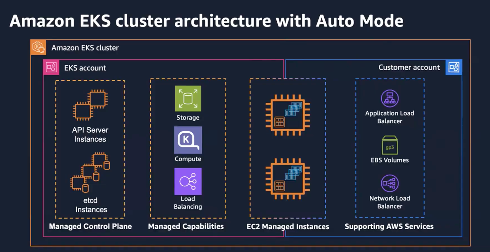
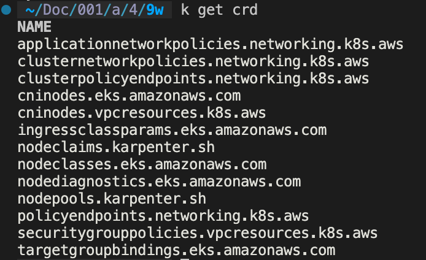
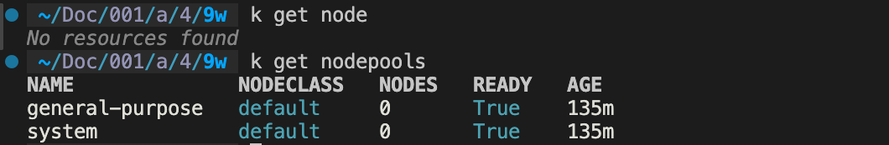

> *CloudNet 팀의 [2026년 AWS EKS Workshop Study 4기](https://gasidaseo.notion.site/26-AWS-EKS-Hands-on-Study-4-31a50aec5edf804b8294d8d512c43370) 9주차 학습 내용을 담고 있습니다.*
>


## EKS Auto Mode란?

기존 Standard Mode에서는 Control Plane은 AWS에서 관리했지만, 아래 영역은 팀에서 관리해야합니다.

```
├── Worker Node (EC2)
│   ├── AMI 선택 및 업데이트
│   └── OS 패치
├── Node 오토 스케일링
│   ├── Cluster Autoscaler 설치/운영
│   └── (또는) Karpenter 설치/운영
├── 핵심 Add-on
│   ├── CoreDNS
│   ├── kube-proxy
│   ├── VPC CNI
│   ├── EBS CSI Driver
│   ├── AWS Load Balancer Controller
│   └── Pod Identity Agent
```

EKS Auto Mode는 이 목록을 AWS 관리 영역으로 올려 데이터 플레인 운영이 자동화됩니다.

## Auto Mode 아키텍처: 무엇이 달라지는가




EKS Auto Mode의 궁극적인 목표는 Karpenter를 Self-Managed해서, 최적으로 튜닝한 것과 비슷한 성능을 내는 것입니다. 기본적으로 Auto Mode는 Karpenter를 기반으로 컴퓨팅 용량을 자동으로 확장합니다. 
EKS Auto Mode를 사용하면 EBS CSI Driver, Load Balancer Controller 등의 EKS에서 사용하는 주요 Add-on들을 AWS에서 관리하게 됩니다.

즉, Control-plane 뿐만 아니라 Node Group도 AWS에서 관리하게 됩니다. 

### 관리 영역 비교

| 관리 영역 | 기존 EKS Standard Mode | EKS Auto Mode |
|---|---|---|
| 컨트롤 플레인 | AWS 관리 | AWS 관리 |
| Worker Node (EC2) | 고객/팀 관리 | **AWS 관리** (Bottlerocket 기반) |
| 노드 오토스케일링 | CA / Karpenter 직접 설치 | **Karpenter 내장** (managed) |
| OS 패치·업그레이드 | 팀이 AMI 교체 | **AWS 자동** (최대 21일 수명) |
| 핵심 Add-on | 별도 설치·버전 관리 | **AWS 자동 설치·업그레이드** |
| 네트워크 정책 / Ingress | 별도 컨트롤러 | **기본 제공** |
| 스토리지 클래스 | 별도 설정 | **EBS gp3 + 암호화 기본** |
| 비용 모델 | EC2 + EKS 컨트롤 플레인 | EC2 + 컴퓨트 관리 요금 (~+12%) |


### EC2 Managed Instance 모델

Auto Mode에서 EC2 인스턴스는 고객 계정에 보이지만, ECS나 Lambda와 같이 AWS에서 라이프사이클을 관리하여 다음과 같은 특징을 가집니다.

- 인스턴스는 AWS 콘솔에서 보이고 비용도 정상 청구됨
- SSH/SSM 직접 접속 불가 — 노드를 직접 들여다볼 수 없음
- Karpenter, ALB Controller 등 managed 컴포넌트의 로그는 off-cluster에서 동작하므로 기존 방식의 `kubectl logs`가 동작하지 않을 수 있음
    - **디버깅 필요 시:**

```
kubectl debug node/<node-name> --image=busybox   # 임시 디버깅 Pod
# 또는 AWS Support Ticket
```
<!-- 
node_pools에서 general-purpose와 system 두 가지가 있으며, system은 전용 인스턴스를 사용합니다. 주로 kube-system에서 쓰이는 시스템 컴포넌트를 위한 특수 목적 파드들을 놓게 되는데 최소 노드가 보통 1개 이상으로 유지됩니다. -->

### 주요 CRD는 Auto Mode가 설치



Add-on 컨트롤러가 보이지 않아도, targetgroupbindings와 같은 CRD는 클러스터 생성 시 이미 설치된 상태입니다. 

## Hands-on

### EKS Auto Mode 활성화

Terraform eks 모듈 버전 [21.0.0](https://registry.terraform.io/modules/terraform-aws-modules/eks/aws/21.0.0/examples/eks-auto-mode) 기준  compute_config로 EKS Auto Mode를 활성화합니다. (eks_managed_node_groups 미포함)

```
# EKS Auto Mode
compute_config = {
  enabled    = true
  node_pools = ["general-purpose"]
}
```

### 기본 노드 프로비저닝

- Auto Mode 활성화 여부 확인 명령어

```bash
aws eks describe-cluster \
  --name siyoung-eks \
  --query 'cluster.computeConfig'
```
.png)



Auto Mode 클러스터를 처음 만들면 노드가 존재하지 않습니다.

Pod가 요청되면 Spec에 따라 NodePool이 NodeClaim을 생성하고, EC2 Fleet API를 직접 호출해 인스턴스를 프로비저닝합니다.

이 과정에서 Karpenter는 bin-packing을 통해 적절한 인스턴스 타입을 선정하고, 실제 가격·가용성 정보는 Fleet API에 위임합니다.

아래 Deployment를 적용해보았습니다.

```bash
cat <<EOT > nginx-automode-test.yaml
apiVersion: apps/v1
kind: Deployment
metadata:
  name: nginx-automode-test
  namespace: default
spec:
  replicas: 3
  selector:
    matchLabels:
      app: nginx-automode-test
  template:
    metadata:
      labels:
        app: nginx-automode-test
    spec:
      containers:
        - name: nginx
          image: public.ecr.aws/nginx/nginx:1.27
          resources:
            requests:
              cpu: 250m
              memory: 256Mi
            limits:
              cpu: 500m
              memory: 512Mi
EOT
kubectl apply -f nginx-automode-test.yaml
```

적용 후 `kubectl get nodeclaim`으로 명령어 입력 시 c5a.large 타입의 인스턴스가 프로비저닝 된 것이 확인됩니다.

```bash
kubectl get nodeclaim
NAME                    TYPE        CAPACITY    ZONE              NODE                  READY   AGE
general-purpose-rjg4j   c5a.large   on-demand   ap-southeast-1b   i-0c995e29805b4388f   True    111s
```

### Karpenter 인스턴스 타입 선택 로직

Karpenter의 인스턴스 선택 로직은 두 단계입니다.

위 nginx 예제는 총 약 950m CPU, 1.3Gi 메모리가 필요해 `c5a.large`가 선택되었습니다.

1) Step 1 Bin-packing: Pod와 시스템 예약을 합산해 최소 용량 계산

```
Pod 3개 × (250m CPU + 256Mi)
  + 시스템 예약 (kubelet, kube-proxy 등) 약 200m CPU + 500Mi
  = 총 약 950m CPU + 1.3GiB → 최소 필요 인스턴스 = c5a.large
```

2) Step 2 EC2 Fleet API 위임: 후보 인스턴스 풀과 가격/가용성 정보를 바탕으로 실제 인스턴스 타입 선택

```
c5a.large (최소) + 더 큰 59개 후보 → Fleet API에 전달
On-Demand → lowest-price → 그 시점 가장 저렴한 인스턴스 선택
```

Fleet API에 위임하는 이유는 Karpenter가 직접 파악하기 어려운 실시간 가격 정보와 실제 Spare Capacity 데이터를 반영하기 위해서입니다.

<!-- ### Scale-out / Consolidation

- Karpenter는 비용·리소스 관점에서 bin-packing을 선호해, 많은 작은 노드보다 큰 노드 1대를 선택합니다.

- Consolidation 정책:
  - `WhenEmpty` : 빈 노드만 제거
  - `WhenUnderutilized` : 활용도가 낮을 때 마이그레이션 후 제거
  - `WhenEmptyOrUnderutilized` : 둘 다(비용 최적화, Auto Mode 기본값)

기본 `consolidateAfter` 예시는 30s로, 노드가 비거나 저활용 상태이면 빠르게 정리합니다.


Scale-out 시 큰 노드 1대 vs 작은 노드 여러 대
Pod 10개(각 1 CPU + 1Gi)를 요청하면:
bash$ kubectl get nodeclaim
NAME                    TYPE          CAPACITY    ZONE
general-purpose-bdbtx   c5a.large     on-demand   ap-northeast-2c   # 기존
general-purpose-qghnl   c5a.4xlarge   on-demand   ap-northeast-2a   # 신규
작은 노드 여러 대 대신 큰 노드 1대를 선택합니다. 
이유는 노드가 늘어날수록 각각의 시스템 예약 오버헤드, DaemonSet 리소스, ENI 등이 중복으로 소모되기 때문이다 — bin-packing의 핵심 원리다.

Scale-in 시 Consolidation
NodePool Consolidation 설정:
  WhenEmpty             → 완전히 빈 노드만 제거 (안정성 우선)
  WhenUnderutilized     → 활용도 낮을 때 Pod 이동 후 제거
  WhenEmptyOrUnderutilized → 둘 다 (비용 절감 최우선, Auto Mode 기본값)
consolidateAfter: 30s 설정 기준으로, 노드가 비거나 비효율적이 되면 30초 뒤 교체 또는 제거를 시작한다. -->

### LoadBalancer 자동 처리

Auto Mode에서는 `kubectl get all -A` 명령어 입력 시에도 별도의 LB Controller Pod가 클러스터에 보이지 않습니다. 

```bash
kubectl get all -A
NAMESPACE   NAME                                      READY   STATUS    RESTARTS   AGE
default     pod/nginx-automode-test-6c9c6f495-9qx6f   1/1     Running   0          48m
default     pod/nginx-automode-test-6c9c6f495-gnrwr   1/1     Running   0          48m
default     pod/nginx-automode-test-6c9c6f495-zznd2   1/1     Running   0          48m

NAMESPACE     NAME                                TYPE        CLUSTER-IP       EXTERNAL-IP   PORT(S)   AGE
default       service/kubernetes                  ClusterIP   172.20.0.1       <none>        443/TCP   3h24m
kube-system   service/eks-extension-metrics-api   ClusterIP   172.20.125.199   <none>        443/TCP   3h24m

NAMESPACE   NAME                                  READY   UP-TO-DATE   AVAILABLE   AGE
default     deployment.apps/nginx-automode-test   3/3     3            3           48m

NAMESPACE   NAME                                            DESIRED   CURRENT   READY   AGE
default     replicaset.apps/nginx-automode-test-6c9c6f495   3         3         3       48m
```


아래와 같은 Service를 생성하면 mutating webhook이 `loadBalancerClass`를 주입해 컨트롤 플레인에서 ELB를 생성합니다.
사용자는 Controller는 신경쓰지 않고 Service만 생성하면 됩니다.

```bash
cat <<EOT > nginx-lb.yaml
apiVersion: v1
kind: Service
metadata:
  name: nginx-lb
  namespace: default
  annotations:
    service.beta.kubernetes.io/aws-load-balancer-scheme: internet-facing
spec:
  type: LoadBalancer
  selector:
    app: nginx-automode-test
  ports:
    - port: 80
      targetPort: 80
EOT
kubectl apply -f nginx-lb.yaml
```

```bash
kubectl get svc
NAME         TYPE           CLUSTER-IP     EXTERNAL-IP                                                                        PORT(S)        AGE
kubernetes   ClusterIP      172.20.0.1     <none>                                                                             443/TCP        3h36m
nginx-lb     LoadBalancer   172.20.4.201   k8s-default-nginxlb-5422876e55-2bf885d7b53a6837.elb.ap-southeast-1.amazonaws.com   80:32485/TCP   9m4s
```
<!-- 
왜 동작하는가? CloudWatch 로그를 보면 mutating webhook이 개입한다.
eks-load-balancing-webhook → mservice.eks.amazonaws.com
→ spec.loadBalancerClass: "eks.amazonaws.com/nlb" 자동 주입
사용자가 loadBalancerClass를 지정하지 않아도, Auto Mode 전용 webhook이 자동으로 NLB 클래스를 주입하고 컨트롤 플레인 측에서 ELB를 생성한다. -->

### 워크로드 격리: Custom NodePool + Taint/Toleration

기본 Auto Mode는 리소스 요구량에 따라 bin-packing을 수행하므로, 워크로드 특성별 격리를 원하면 Custom NodePool과 `taint`/`toleration`, `nodeSelector`를 함께 사용해야 합니다.

<!-- Auto Mode 기본 동작은 비용 최적화 관점의 bin-packing이다. 워크로드 특성별로 인스턴스 패밀리를 분리하려면 Custom NodePool + Taint/Toleration 조합이 필요하다.
먼저 taint 없이 실험해보면 기대와 다른 결과가 나온다.
bash# Taint 없이 실행 시 — 워크로드 타입 무관하게 같은 노드에 배치됨
cpu-intensive   → m5a.4xlarge (On-Demand)  # c계열 아님!
memory-intensive → m5a.4xlarge (On-Demand)
balanced-workload → m5a.4xlarge, c5a.xlarge
Karpenter는 리소스 요구량 기준으로 bin-pack할 뿐, 워크로드 의미론적 분류는 하지 않는다.
올바른 격리 방법: Taint + NodeSelector + 인스턴스 패밀리 제한 -->

**예시1: CPU 집약형 NodePool (c계열 고정)**

```yaml
apiVersion: karpenter.sh/v1
kind: NodePool
metadata:
  name: cpu-optimized
spec:
  template:
    spec:
      taints:
        - key: workload-type
          value: cpu
          effect: NoSchedule
      requirements:
        - key: karpenter.sh/capacity-type
          operator: In
          values: ["on-demand"]
        - key: node.kubernetes.io/instance-type
          operator: In
          values:
            - c5.large
            - c5.xlarge
            - c5.2xlarge
            - c5a.large
            - c5a.xlarge
            - c5a.2xlarge
      nodeClassRef:
        group: eks.amazonaws.com
        kind: NodeClass
        name: default
  limits:
    cpu: "32"
    memory: 64Gi
  disruption:
    consolidationPolicy: WhenEmptyOrUnderutilized
    consolidateAfter: 60s
```

Deployment에는 `nodeSelector`와 `tolerations`를 설정해 해당 NodePool으로 스케줄링합니다.

```yaml
spec:
  template:
    spec:
      nodeSelector:
        workload-type: cpu
      tolerations:
        - key: workload-type
          operator: Equal
          value: cpu
          effect: NoSchedule
```

**적용 결과:**
cpu-intensive    → c5a.2xlarge  (cpu-optimized NodePool)
memory-intensive → r5a.xlarge   (memory-optimized NodePool)
balanced-workload → m5a.2xlarge (general-compute NodePool)

**Spot NodePool 구성 시 주의사항:** 

Spot NodePool을 구성할 때는 가능한 여러 인스턴스 타입을 허용해 프로비저닝 성공률을 높이는 것이 중요합니다. 단일 타입만 지정하면 해당 capacity pool 부족 시 프로비저닝에 실패할 수 있습니다.

Spot NodePool: 여러 인스턴스 타입 열어두기

```yaml
requirements:
  - key: karpenter.sh/capacity-type
    operator: In
    values: ["spot"]
  - key: node.kubernetes.io/instance-type
    operator: In
    values:
      - m5.large
      - m5.xlarge
      - m5.2xlarge
      - c5.large
      - c5.xlarge
      - c5.2xlarge
      - r5.large
      - r5.xlarge
```

### PodDisruptionBudget과 Consolidation

Karpenter가 노드를 비울 때는 먼저 PDB를 확인합니다. PDB에 의해 허용 가능한 중단 수가 0이면 Eviction이 보류되어 순차적으로만 진행됩니다. 

```text
Karpenter: "이 노드 비우고 싶다" → Eviction 요청
API Server: PDB 확인
  → ALLOWED DISRUPTIONS > 0: 허용
  → ALLOWED DISRUPTIONS = 0: 거부 → Karpenter 대기
실험 설정: minAvailable: 2 PDB를 가진 4 replica Deployment
replicas를 2로 줄이면:

- PDB 없는 워크로드: 즉시 drain/제거
- PDB 있는 워크로드: Consolidation은 일어나지만 한 번에 1개씩만 처리
```

PDB는 중단을 완전히 막지 않지만, 중단 속도를 조절합니다. PDB가 있어도 Consolidation은 완료되지만 최소 가용성을 유지하면서 순차적으로 진행됩니다.
따라서 프로덕션 워크로드에는 반드시 PDB를 설정해야 합니다.

### 노드 수명 자동 교체 (`expireAfter`)

Auto Mode에서는 Karpenter와 동일하게 보안 패치 및 자동 업그레이드를 강제 적용하기 위한 노드 수명 자동 교체가 존재합니다.  

기본 NodePool의 expireAfter는 336h (14일) 이며, AWS에서는 최대 21일까지 상향 조정 가능합니다. 


```bash
kubectl describe nodepool general-purpose | grep -i expire
      Expire After:  336h
```

만료된 노드는 Karpenter가 자동으로 새 NodeClaim을 생성하고 드레인합니다.

`budgets.nodes: "1"` 설정으로 동시 교체 수를 제한할 수 있습니다.

```yaml
disruption:
  consolidationPolicy: WhenEmptyOrUnderutilized
  consolidateAfter: 30s
  budgets:
    - nodes: "1"    # 동시에 1개 노드만 교체
```

## 도입 관점에서 Trade-off

**도입이 유리한 경우:**

- 운영 부담을 줄이고 빠르게 프로덕션 수준의 클러스터를 확보하고 싶은 팀
- 워크로드 변동이 크고 Karpenter 기반의 빠른 프로비저닝(30s~1min)이 유리한 환경
- Hub-Spoke 멀티클러스터
- 스파이크성 트래픽이 잦아 자동 비용 최적화(Consolidation)가 중요한 경우

**신중히 검토해야 할 경우**


- 노드에 직접 접속(SSH/SSM)이 필요하거나 Custom AMI에 의존하는 경우
    - Auto Mode 노드는 접근 불가
    - Bottlerocket 외 AMI 미지원
- Cilium 등 서드파티 CNI를 반드시 사용해야 하는 환경
    - Auto Mode에서 third-party CNI, kube-proxy lease mode 미지원
- 컴플라이언스상 노드 제어·증적이 필수인 경우
- 비용에 민감하고 운영 인력이 충분해 직접 관리로 더 낮은 비용을 기대하는 경우

!!! info "단일 클러스터에서 1,000개 이상 Service를 운영할 때 Cilium CNI의 성능 향상이 체감된다는 사례가 있다. 그러나 AWS Best Practice는 Cell-based 멀티클러스터 구성을 권장하므로, 클러스터를 충분히 작게 나누면 사실상 Cilium이 필요한 상황이 줄어든다."

<!-- ### 노드 프로비저닝 속도 비교

기존 MNG + Cluster Autoscaler (통상 2~5분):
  Pod Pending 감지 (CA 스캔 주기 10초)
  → ASG DesiredCapacity 증가
  → EC2 Launch
  → OS 부팅
  → kubelet 시작
  → Node Ready
  → Pod 스케줄링

Auto Mode (Karpenter 기반, 통상 30초~1분):
  Pod Pending 감지 (즉시)
  → EC2 Fleet API 직접 호출
  → EC2 Launch
  → OS 부팅 (Bottlerocket = 경량)
  → kubelet 시작
  → Node Ready
  → Pod 스케줄링
ASG를 거치지 않고 Fleet API를 직접 호출하는 점과 Bottlerocket의 경량 부팅이 속도 차이의 주요 원인이다. -->

## 주요 명령어

<!-- #### 도입 전

- SSH/특수 AMI/커스텀 DaemonSet 의존도 사전 검토
- AmazonEKSAutoClusterRole / AmazonEKSAutoNodeRole IAM 역할 생성
- 기존 클러스터 활성화 시 자체 설치 Karpenter / LB Controller / EBS CSI 충돌 점검 및 제거
- 운영 워크로드 PDB 설정 (노드 교체 시 가용성 확보)

#### 도입 후 운영

- Container Insights Enhanced Observability 활성화 (노드 직접 접근이 안 되므로 K8s 메트릭 중심 모니터링 필수)
- NodePool limits.cpu / limits.memory 설정으로 비용 폭주 방어
- Spot/On-Demand 비율 NodePool 분리 (karpenter.sh/capacity-type)
- Pod Identity 기반 권한 모델 전환 (IRSA 잔재 정리)
- 컴퓨팅 관리 요금 추가분을 월 비용 보고서에 반영 -->


- Auto Mode 노드 목록

```bash
kubectl get nodes -L eks.amazonaws.com/nodepool,eks.amazonaws.com/instance-category
```

- 노드 수명 확인

```bash
kubectl get nodes -o custom-columns=\
NAME:.metadata.name,\
AGE:.metadata.creationTimestamp,\
NODEPOOL:.metadata.labels.eks\\.amazonaws\\.com/nodepool,\
INSTANCE:.metadata.labels.node\\.kubernetes\\.io/instance-type
```

- Pending Pod / 스케줄링 실패

```bash
kubectl get pods -A --field-selector=status.phase=Pending
kubectl get events -A --field-selector reason=FailedScheduling \
  --sort-by='.lastTimestamp' | tail -20
```

- NodePool 한도 도달 여부

```bash
kubectl describe nodepool general-purpose | grep -A5 Limits
```

- 노드 강제 교체, NodeClaim 삭제가 권장 방법 (Karpenter 흐름 유지)

```bash
kubectl get nodeclaims.karpenter.sh
kubectl delete nodeclaim <nodeclaim-name>
```

- kubectl delete node는 비권장 — PDB 확인 없이 진행될 수 있음

## 정리

EKS Auto Mode는 운영 부담을 줄여주는 옵션이지만, 노드 접근성·커스터마이즈 한계, 그리고 추가 관리 요금 같은 트레이드오프가 존재합니다. 사용 전 요구사항(특수 AMI, CNI, 컴플라이언스 등)을 점검하고, NodePool·Taint/Toleration·PDB·expireAfter 같은 제어 레버를 설계해 도입하는 것이 좋습니다.

<!-- ## 참고 자료

Amazon EKS Auto Mode 공식 문서
Karpenter NodePool API
EKS Auto Mode Best Practices
AWS re:Invent 2025 - EKS Auto Mode 세션 (CNS354)
How does Karpenter dynamically select instance types? -->