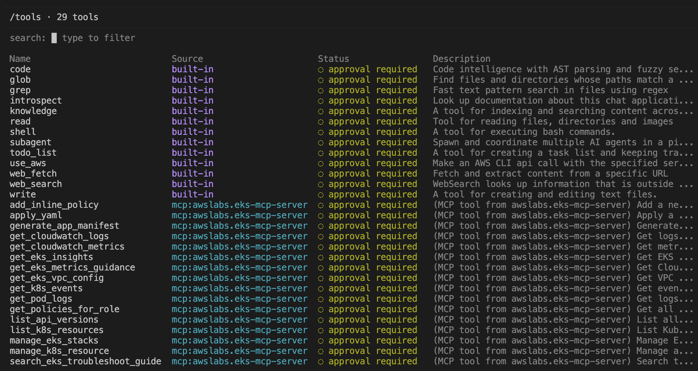

> *CloudNet 팀의 [2026년 AWS EKS Workshop Study 4기](https://gasidaseo.notion.site/26-AWS-EKS-Hands-on-Study-4-31a50aec5edf804b8294d8d512c43370) 9주차 학습 내용을 담고 있습니다.*
>
> *[Operating EKS with Amazon Q CLI](https://www.eksworkshop.com/docs/aiml/q-cli/) 워크샵을 정리하였습니다.*


!!! info "Amazon Q CLI는 Kiro CLI로 변경되었습니다. 워크샵 문서는 Amazon Q CLI 기준으로 작성되어 있으나, 이 글에서는 Kiro CLI로 실습을 진행하였습니다. [Link](https://docs.aws.amazon.com/amazonq/latest/qdeveloper-ug/command-line.html)"


## 개요
 
Kiro CLI는 자연어 프롬프트로 EKS 클러스터를 운영할 수 있는 AI 기반 CLI 도구입니다. MCP(Model Context Protocol) 서버와 연동하면 클러스터 정보 조회, 리소스 분석, 트러블슈팅을 자연어로 수행할 수 있습니다.
 
EKS 워크샵 내용을 따라 EKS MCP Server를 Kiro CLI에 연결하여 다음을 테스트합니다:
 
- 클러스터 세부 정보 조회
- Pod 스케줄링 실패(`Pending`) 원인 분석
- 컨테이너 기동 실패(`CreateContainerConfigError`) 원인 분석


## Kiro CLI & MCP 서버 설치 및 설정

### Kiro 설치

```
# Kiro 설치
curl -fsSL https://cli.kiro.dev/install | bash

# uvx 설치 (EKS MCP 서버 실행에 필요)
curl -LsSf https://astral.sh/uv/install.sh | sh
source ~/.zshrc

# 설치 확인
uvx --version
```

!!! tip "uvx란?"
    uvx는 Python 패키지를 전역 설치 없이 격리된 환경에서 실행하는 도구입니다.
    Node.js의 `npx`와 유사하며, EKS MCP 서버는 uvx를 통해 실행됩니다.

### EKS MCP 서버 설정

Kiro CLI 전역 설정 파일 경로: ~/.kiro/settings/mcp.json


```bash
mkdir -p ~/.kiro/settings
cat > ~/.kiro/settings/mcp.json << 'EOF'
{
  "mcpServers": {
    "awslabs.eks-mcp-server": {
      "command": "uvx",
      "args": [
        "--with",
        "mcp==1.18.0",
        "awslabs.eks-mcp-server@0.1.13",
        "--allow-write",
        "--allow-sensitive-data-access"
      ],
      "env": {
        "FASTMCP_LOG_LEVEL": "ERROR"
      },
      "autoApprove": [],
      "disabled": false
    }
  }
}
EOF
```


### MCP 서버 확인

- `kiro-cli`를 열고 `/tools`  명령어를 입력하면 아래 EKS MCP 서버를 확인할 수 있습니다. 



`mcp:awslabs.eks-mcp-server` 항목이 보이면 정상적으로 연결된 것이며, 주요 도구는 다음과 같습니다.
 
| 도구 | 설명 |
|------|------|
| `list_k8s_resources` | Kubernetes 리소스 목록 조회 |
| `manage_k8s_resource` | 리소스 상세 조회/수정 |
| `get_k8s_events` | Pod/리소스 이벤트 조회 |
| `get_pod_logs` | Pod 로그 조회 |
| `get_eks_insights` | EKS Insights 조회 |
| `search_eks_troubleshoot_guide` | EKS 트러블슈팅 가이드 검색 |
 
모든 도구는 기본적으로 `approval required` 상태로, 작업 전에 사용자 승인을 요구합니다.


## 클러스터 세부 정보 조회

### 클러스터 요약 정보

<details><summary>EKS 클러스터 요약 정보 생성 프롬프트 입력</summary>

```bash
─────────────────────────────────────────────────────────────────────────────────────────────────────────────────────────────────────
  Summarize the configuration of the siyoung-eks  EKS cluster in ap-southeast-1 region
   
● use_aws
    ╰ label=Describe siyoung-eks EKS cluster, service_name=eks, operation_name=describe-cluster, region=ap-southeast-1
● use_aws
    ╰ label=List node groups for siyoung-eks, service_name=eks, operation_name=list-nodegroups, region=ap-southeast-1
    {
      "exit_status": "0",
      "stdout": "{\n    \"nodegroups\": []\n}\n",
    ...+2 lines (ctrl+o to toggle)

  Here's a summary of the siyoung-eks cluster configuration:
  
  General
  
  - Region: ap-southeast-1 (Singapore)
  - Kubernetes version: 1.35
  - Platform version: eks.13
  - Status: ACTIVE
  - Created: 2026-05-17
  - Tags: Environment=cloudneta-lab, Terraform=true
  
  Networking
  
  - VPC: vpc-0d9353d9b7c65bd4e
  - Subnets: 3 subnets across the VPC
  - Service CIDR: 172.20.0.0/16 (IPv4)
  - Endpoint access: Both public (0.0.0.0/0) and private enabled
  
  Compute (EKS Auto Mode)
  
  - Auto Mode: enabled with node pools general-purpose and system
  - No managed node groups (Auto Mode handles compute)
  - Block storage: enabled
  - Elastic Load Balancing: enabled
  - Control plane scaling tier: standard
  
  Security
  
  - Authentication: API_AND_CONFIG_MAP
  - Secrets encryption: KMS key d72ff1c2-2c99-434b-8ecb-f48fd72bc4c5
  - OIDC issuer configured
  - Deletion protection: disabled
  
  Logging
  
  - All control plane log types enabled: api, audit, authenticator, controllerManager, scheduler
  
  Support
  
  - Upgrade policy: EXTENDED support

▸ Credits: 0.21 • Time: 12s
```

</details>


클러스터 요약 정보를 요청하는 프롬프트에서는 Kiro CLI가 EKS MCP 서버의 도구가 아닌 Kiro CLI 내장 `use_aws` 도구가 사용하였습니다. EKS MCP 서버는 Kubernetes API 수준의 리소스 조회에 특화되어 있고, AWS API 수준의 조회(`describe-cluster` 등)는 내장 도구가 담당합니다.

### Pod 목록 및 네트워크 정보 조회

<details><summary>Default 네임스페이스의 파드와 각 파드의 IP/호스트네임 목록 요청 프롬프트</summary>

```bash
  List all pods in the default namespace with their IP addresses along with the host names
  they are running on.                                                                  
   
● list_k8s_resources
    ╰ cluster_name=siyoung-eks, kind=Pod, api_version=v1, namespace=default
   NAME                                  READY   STATUS    RESTARTS   AGE     IP
    NODE                  NOMINATED NODE   READINESS GATES
    nginx-automode-test-6c9c6f495-9qx6f   1/1     Running   0          5h26m
    10.77.22.80   i-0c995e29805b4388f   <none>           <none>
    nginx-automode-test-6c9c6f495-gnrwr   1/1     Running   0          5h26m
    10.77.22.81   i-0c995e29805b4388f   <none>           <none>
    nginx-automode-test-6c9c6f495-zznd2   1/1     Running   0          5h26m
    10.77.22.82   i-0c995e29805b4388f   <none>           <none>
    

  Here are the pods in the default namespace:
  
  ┌─────────────────────────────────────┬─────────────┬─────────────────────┐
  │ Pod                                 │ IP          │ Node (Host)         │
  ├─────────────────────────────────────┼─────────────┼─────────────────────┤
  │ nginx-automode-test-6c9c6f495-9qx6f │ 10.77.22.80 │ i-0c995e29805b4388f │
  ├─────────────────────────────────────┼─────────────┼─────────────────────┤
  │ nginx-automode-test-6c9c6f495-gnrwr │ 10.77.22.81 │ i-0c995e29805b4388f │
  ├─────────────────────────────────────┼─────────────┼─────────────────────┤
  │ nginx-automode-test-6c9c6f495-zznd2 │ 10.77.22.82 │ i-0c995e29805b4388f │
  └─────────────────────────────────────┴─────────────┴─────────────────────┘
  
  All 3 pods are part of the nginx-automode-test deployment, all running on the same
  node (i-0c995e29805b4388f), and all in Running status.
```

</details>

`list_k8s_resources` 가 호출된 것을 볼 수 있습니다. 이 Tool은 EKS MCP 서버가 제공하는 것으로, `kubectl get pods -o wide`와 동일한 정보를 자연어 요청으로 조회할 수 있습니다.

## 트러블슈팅 테스트 1 - PVC 누락으로 인한 Pending
 
### 시나리오

존재하지 않는 PVC를 마운트하는 Pod를 배포하여 스케줄링 실패를 재현합니다.

```bash
cat << 'EOF' | kubectl apply -f -
apiVersion: v1
kind: Pod
metadata:
  name: failing-pod
  namespace: default
  labels:
    app: volume-demo
spec:
  containers:
  - name: main-container
    image: busybox:1.37.0-glibc
    command: ["sleep", "3600"]
    resources:
      requests:
        cpu: 100m
        memory: 128Mi
      limits:
        cpu: 200m
        memory: 256Mi
    volumeMounts:
    - name: persistent-storage
      mountPath: /data
  volumes:
  - name: persistent-storage
    persistentVolumeClaim:
      claimName: my-pvc
  restartPolicy: Always
  serviceAccountName: default
EOF
```

- Pending 상태 확인

```
kubectl get pods -n default

NAME                                  READY   STATUS    RESTARTS   AGE
failing-pod                           0/1     Pending   0          115s
nginx-automode-test-6c9c6f495-9qx6f   1/1     Running   0          5h38m
nginx-automode-test-6c9c6f495-gnrwr   1/1     Running   0          5h38m
nginx-automode-test-6c9c6f495-zznd2   1/1     Running   0          5h38m
```

### Kiro CLI 원인 분석

<details><summary>Pending Pod 트러블슈팅 프롬프트 실행 결과</summary>

```bash
I have a pod stuck in a pending state in my siyoung-eks cluster in ap-southeast-1.  
  Find the cause of the failure and provide me with a summary of the approach to solve
  it.                                                                                 
   
● list_k8s_resources
    ╰ cluster_name=siyoung-eks, kind=Pod, api_version=v1

  The suspect is failing-pod. It mounts a PVC called my-pvc. Let me check the pod events
  and the PVC status simultaneously.
● get_k8s_events
    ╰ cluster_name=siyoung-eks, kind=Pod, name=failing-pod, namespace=default
● list_k8s_resources
    ╰ cluster_name=siyoung-eks, kind=PersistentVolumeClaim, api_version=v1,
    namespace=default
    {
      "content": [
        {
    ...+24 lines (ctrl+o to toggle)

  Root cause is clear.
  
  ──────────────────────────────────────────────────────────────────────────────────────
  
  Root Cause
  
  failing-pod is stuck in Pending because it references a PersistentVolumeClaim named
  my-pvc that does not exist in the default namespace. The scheduler cannot place the
  pod until the PVC is present and bound.
  
  FailedScheduling: PersistentVolumeClaim "my-pvc" not found
  
    "text": "Successfully listed 0 PersistentVolumeClaim resources in default/all
    namespaces",
            "annotations": null,
            "_meta": null
          }
        ],
        "structuredContent": null,
        "isError": false,
        "kind": "PersistentVolumeClaim",
        "api_version": "v1",
        "namespace": "default",
        "count": 0,
        "items": []
      },
      "isError": false
    }

  Root cause is clear.
  
  ──────────────────────────────────────────────────────────────────────────────────────
  
  Root Cause
  
  failing-pod is stuck in Pending because it references a PersistentVolumeClaim named
  my-pvc that does not exist in the default namespace. The scheduler cannot place the
  pod until the PVC is present and bound.
  
  FailedScheduling: PersistentVolumeClaim "my-pvc" not found
  
  ──────────────────────────────────────────────────────────────────────────────────────
  
  How to fix it
  
  You need to create the missing PVC before the pod can be scheduled. The approach
  depends on your storage needs:
  
  1. Create the PVC — Define a PVC named my-pvc in the default namespace with an
  appropriate StorageClass and access mode. For EKS Auto Mode, the ebs.csi.aws.com
   provisioner with ReadWriteOnce is the typical choice:
  
  apiVersion: v1
  kind: PersistentVolumeClaim
  metadata:
    name: my-pvc
    namespace: default
  spec:
    accessModes:
      - ReadWriteOnce
    storageClassName: gp2  # or your cluster's default StorageClass
    resources:
      requests:
        storage: 1Gi       # adjust to your needs
  
  2. Verify the StorageClass exists — Run kubectl get storageclass to confirm which
  StorageClasses are available in your cluster and pick the right one.
  3. Apply and wait for binding — Once the PVC is created, the dynamic provisioner will
  create the underlying EBS volume and bind the PVC. The scheduler will then place
  failing-pod automatically — no pod restart needed.
  
  Want me to create the PVC for you? If so, let me know the desired storage size and
  StorageClass (or I can check what's available in the cluster).

▸ Credits: 0.31 • Time: 24s
```

</details>

Kiro CLI가 `list_k8s_resources` → `get_k8s_events` → `list_k8s_resources(PVC)` 순서로 EKS MCP Server Tool을 호출하며 원인을 추적했습니다. 

## 트러블슈팅 테스트 2 - ConfigMap 누락으로 인한 CreateContainerConfigError
 
### 시나리오
 
존재하지 않는 ConfigMap을 `envFrom`으로 참조하는 Pod를 배포하여 컨테이너 기동 실패를 재현합니다.

```bash
cat << 'EOF' | kubectl apply -f -
apiVersion: v1
kind: Pod
metadata:
  name: crashloop-pod
  namespace: default
spec:
  containers:
  - name: app
    image: busybox:1.37.0-glibc
    command: ["sh", "-c", "echo $DB_HOST && sleep 3600"]
    envFrom:
    - configMapRef:
        name: app-config
  restartPolicy: Always
EOF
```

- 상태 확인
```bash
kubectl get pods -n default

NAME                                  READY   STATUS                       RESTARTS   AGE
crashloop-pod                         0/1     CreateContainerConfigError   0          88s
nginx-automode-test-6c9c6f495-9qx6f   1/1     Running                      0          5h45m
nginx-automode-test-6c9c6f495-gnrwr   1/1     Running                      0          5h45m
nginx-automode-test-6c9c6f495-zznd2   1/1     Running                      0          5h45m
```


### Kiro CLI 원인 분석
 
<details><summary>CreateContainerConfigError 트러블슈팅 프롬프트 실행 결과</summary>

```bash
────────────────────────────────────────────────────────────────────────────────────────────────────────────────────────────────────
  I have a pod called crashloop-pod in the default namespace         
  of siyoung-eks cluster in ap-southeast-1 that is failing to start. 
  Troubleshoot the issue and tell me how to fix it.                  
   
● get_k8s_events
    ╰ cluster_name=siyoung-eks, kind=Pod, name=crashloop-pod, namespace=default
● manage_k8s_resource
    ╰ operation=read, cluster_name=siyoung-eks, kind=Pod, api_version=v1

  Root cause: missing ConfigMap app-config
  
  The pod is stuck in CreateContainerConfigError — not actually crashing in a loop, but failing to start. The container uses envFrom
   to load all env vars from a ConfigMap named app-config, but that ConfigMap doesn't exist in the default namespace.
  
  Fix: Create the missing ConfigMap. Based on the pod's command (echo $DB_HOST), it expects at least a DB_HOST key. Create it with
  the appropriate value:
  
  apiVersion: v1
  kind: ConfigMap
  metadata:
    name: app-config
    namespace: default
  data:
    DB_HOST: <your-database-host>
  
  Apply it:
  
  kubectl apply -f app-config.yaml
  
  Once the ConfigMap exists, the kubelet will automatically retry and the pod will start — no pod restart needed. If you don't know
  the exact keys the app needs, start with DB_HOST (the only one referenced in the command) and add others as required.
```

</details>

Kiro CLI가 아래와 같은 과정으로 트러블슈팅을 진행하였습니다.

-  `get_k8s_events` → `manage_k8s_resource` 순서로 이벤트 확인 후 Pod 스펙 분석
-  `CreateContainerConfigError`와 `CrashLoopBackOff`를 구분하고, ConfigMap 생성 시 kubelet이 자동으로 재시도하며 Pod가 기동된다는 동작 방식 설명